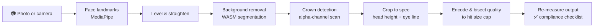

<div align="center">

# 📸 SpecShot

### Privacy-first, in-browser image studio — with government-spec ID photo compliance

**Turn a selfie into an ID photo that actually passes — then compress, crop, convert, watermark and more. Nothing is ever uploaded.**


[Features](#-features) · [How it works](#-how-the-id-photo-pipeline-works) · [Tech stack](#-tech-stack) · [Getting started](#-getting-started) · [Architecture](#-architecture) · [Contact](#-author)

</div>

---

## 📌 Overview

Most "passport photo" websites eyeball the crop or hide the result behind a paywall — and you only find out it was wrong when the application is rejected.

**SpecShot measures the photo the way an examiner would.** It detects the face, finds the true top of the head, crops to the exact head-height and eye-line targets published by the government, and then **re-measures the finished file** against a pass/fail checklist *before* you download.

What started as an ID-photo checker grew into a complete **browser-based image studio** of 13+ tools that share one workspace and one rule: **every pixel is processed on your device**. There is no backend, no API route and no account.

> 🔒 **Private by construction** — face detection and background removal run as WebAssembly in the browser, and re-encoding strips EXIF/GPS metadata on the way out. There is no server that could see your photo, because there is no server.

---

## ✨ Features

### 🪪 ID photo engine
- **Spec-accurate auto-crop** to verified government document requirements, with a crown / eye / chin guide overlay
- **Live compliance checklist** — head height, eye line, background, resolution and file size
- **Multiple documents from one photo** in a single pass
- **Print sheets** — tile 4–30 copies onto a 4×6 in or A4 sheet with cut guides
- **In-browser camera capture** with live face-framing guidance

### 🧰 Image studio

| Category | Tools |
|---|---|
| **Optimize** | Compress to an exact KB target or quality level · Convert JPG / PNG / WebP |
| **Transform** | Resize (pixels or %, aspect lock) · Crop (drag selection + presets) · Rotate & flip |
| **Create** | Photo editor (light, colour, filters, border, caption) · Watermark (text or logo, tiled or single) · Meme generator |
| **Documents** | HEIC → JPG/PNG · Images → PDF · PDF → JPG/PNG · Signature cleaner for exam/visa portals |

### 🧩 Platform
- **Tools chain together** — hand a crop or edit straight into the compressor without touching disk
- **Installable PWA** — works offline after first load
- **SEO spec pages** — every verified document gets its own page, cited to its government source
- **Full legal set + real consent banner** — the ad script itself is gated behind consent, and declining never breaks a tool
- **Static export** — ships as plain HTML/CSS/JS; deploys to any static host

---

## 🔬 How the ID photo pipeline works



**The hard problem:** passport specs measure head height from the **crown** (top of the skull, including hair), but face-mesh landmarks stop at the forehead — typically 15–40 mm too low. SpecShot solves this by removing the background and scanning the alpha mask for the first row with a sustained run of opaque pixels inside a band centred on the face, which separates real hair from mask noise.

**File size caps** are met with a binary search over encoder quality, so the output lands as close to the limit as possible without exceeding it.

---

## 🛠 Tech stack

| Layer | Technology |
|---|---|
| **Framework** | Next.js 15 (App Router, static export), React 19 |
| **Language** | TypeScript (strict mode) |
| **Styling** | Tailwind CSS v4, Geist + Inter via `next/font`, Material Symbols |
| **Computer vision** | MediaPipe Tasks Vision (face landmarks), `@imgly/background-removal` (WASM) |
| **Documents** | `pdf-lib` (write), `pdfjs-dist` (render), `heic2any` (HEIC decode) |
| **Graphics** | Canvas 2D pipeline, `ogl` (WebGL landing background) |
| **Testing** | Vitest (14 suites covering the image engine) |
| **Delivery** | Service worker (PWA), code-split heavy WASM/PDF libraries loaded only on use |

---

## 🏗 Architecture

```
app/                 Routes — landing page, tool hub, one route per tool,
                     per-document SEO pages, legal pages, sitemap & robots
components/          One "studio" UI per tool, sharing a common frame (studioUi.tsx)
lib/engine/          Pure, unit-tested image math: crown detection, crop geometry,
                     encoding, compression, print sheets, watermark, rotate, PDF, HEIC
lib/handoff.ts       In-browser image hand-off between tools
lib/tools.ts         Single source of truth for every tool's route and nav entry
specs/               One JSON file per document, cited to a government source
scripts/             Spec validator (runs before every build), icon + PDF worker setup
tests/               Vitest suites for lib/engine
```

### Engineering highlights
- **Pure-function engine** — image math operates on plain `{ width, height, data }` buffers, so it's fully unit-testable without a browser.
- **Data integrity gate** — every document spec must be `verified: true` against a primary government source, or the strict validator excludes it from production builds. SpecShot would rather ship fewer documents than one wrong number.
- **Zero-server privacy model** — no API routes exist; privacy is an architectural guarantee, not a policy promise.
- **Performance budget** — WASM models and PDF/HEIC libraries are lazy-loaded only when a tool needs them.
- **Consent-correct ads** — the consent banner blocks the third-party script itself, not just the ad slot.

### Supported documents

| Country | Document | Status |
|---|---|---|
| 🇬🇧 United Kingdom | Passport | ✅ Verified |
| 🇺🇸 United States | Passport | ⏳ Pending verification |
| 🇨🇦 Canada | Passport | ⏳ Pending verification |

---

## 🚀 Getting started

**Prerequisites:** Node.js 18.18+ (20+ recommended)

```bash
git clone https://github.com/tan8696/SpecShot.git
cd SpecShot
npm install
npm run dev          # http://localhost:3000
```

### Scripts

| Command | Description |
|---|---|
| `npm run dev` | Start the development server |
| `npm run build` | Validate specs (strict), then produce a static export in `out/` |
| `npm start` | Serve the static `out/` folder locally |
| `npm test` | Run the Vitest suite once |
| `npm run test:watch` | Run tests in watch mode |
| `npm run typecheck` | Type-check with `tsc --noEmit` |
| `npm run validate` | Validate document spec data |

### Environment variables

| Variable | Required | Purpose |
|---|---|---|
| `NEXT_PUBLIC_SITE_URL` | Production | Absolute base URL used for metadata, `sitemap.xml` and `robots.txt` |
| `NEXT_PUBLIC_ADSENSE_CLIENT_ID` | Optional | AdSense publisher ID — no ad script loads when unset |
| `NEXT_PUBLIC_ADSENSE_SLOT_ID` | Optional | AdSense ad unit slot ID |

<details>
<summary><b>📋 Pre-launch checklist</b></summary>

- [ ] Set `NEXT_PUBLIC_SITE_URL` to the production domain
- [ ] Review `/privacy`, `/terms`, `/cookies` and `/data` for your jurisdiction
- [ ] Verify the US and Canada specs against primary sources and set `"verified": true`
- [ ] Apply for AdSense with the live URL; once approved, set the AdSense env vars and add `public/ads.txt`

</details>

---

## 🗺 Roadmap

- [ ] Verify and enable US and Canada passport specs
- [ ] Add more countries and visa / exam photo specs
- [ ] Batch processing across multiple images
- [ ] Additional export presets for popular application portals

---

## 👤 Author

**Tanish Lather** — Full-stack developer

[](https://github.com/tan8696)
[](https://www.linkedin.com/in/tanish-lather-27456b40a)
[](mailto:tanishla1100@gmail.com)

💼 *Open to freelance and full-time opportunities — feel free to reach out.*

---

## 📄 License

Private — all rights reserved. The source is shared for portfolio and evaluation purposes.
